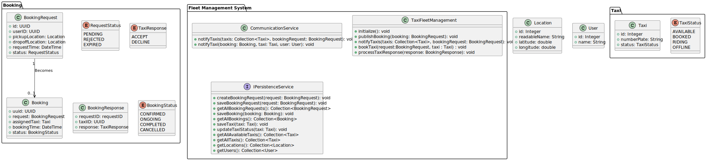

# Architectural Design Overview

The Taxi Fleet Management Application follows a modular and layered architecture that promotes separation of concerns, scalability, and maintainability. 

The primary layers are:

## 1. Web Layer

This is the single point of entry for all the users. The sub modules are:

| sub-Module          | Responsibility                                                               |
| ------------------- | ---------------------------------------------------------------------------- |
| management-webapp   | Exposes REST APIs that the Angular frontend can consume.                     |
| taxi-fleet-frontend | A standalone Angular application that acts as the admin/taxi/user dashboard. |

## 2. System/Business Layer

This layer holds the core business logic of the system. It contains various sub modules such as
    It orchestrates processes, enforces domain rules, and coordinates between users, taxis, and bookings.

| sub-Module | Responsibility                                                                                                                                                                    |
| ---------- | --------------------------------------------------------------------------------------------------------------------------------------------------------------------------------- |
| common     | common functionalities such as Common Model classes, Exceptions, utilities for thread Locks and validation.                                                                       |
| user       | Module for user related functionalities.                                                                                                                                          |
| taxi       | Module for taxi related functionalities.                                                                                                                                          |
| system     | The central and important Module for Taxi fleet management system, which contains all the core implementations of system. Interact with persistence layer  to load and save data. |

## 3. Persistence Layer
provides functionalities for persisting data onto the Postgres DB. This is a plugable module, could be replaced by any persistence module based implementation.

# Key Architectural Decisions
- **Limited User fuctionalities**  
   - The user dashboard is not fully implemented. This is used as a facade for creating the booking requests to the taxi.
   - The current booking of users is not maintained over sessions.

- **Modular Structure with Clear Layer Separation**  
   - Each module (user, taxi, system, etc.) is independently manageable and testable. This makes the system easier to evolve and extend.

- **Usage of Spring boot in application**
  - The spring boot is used only in the web layer to ensure that rest of the modules can be used in other types of project as well, eg. Desktop application without pulling in additional spring dependencies.
  - Only front end module uses the Spring web application for varioius controllers and services.
  - tried my level best to manage all the services/system/repository as singleton as much as possible.
  
- **Persistence Layer** 
  - Initially thought about using the in-memory database, but, that would not help us in the persistence of data over various server sessions.
  - Hence, decided on using a DB server to save the data.
  - On deciding whether to use JDBC, Hibernate or Spring JPA to manage the repositories, I settled on Hiverbate, because
    - JDBC would require queries to be added, which might not be required on other 2 options.
    - Spring JPA would bring in repository concepts, which would have many additional methods to query the DB
    - I wanted to not write queries as well as have minimal responsibility for the Repository.
  - The persistence module implemented an interface from system module and provides the Persistence service. It is possible to use another implementation in a new module named in-memory_persistence without changing in the system module.
  - Even though hibernate provides transactional locks for consistency across various read and write operation, added a ReadWriteLock on the Java repository layer to have additional control. P.S. : This would not work over Joining tables, as currently, each repository manages single table data.

- **Real-Time Notifications with SSE**  
    - Server-Sent Events (SSE) were chosen over WebSocket for simplicity and one-way push from server to client. Ideal for booking requests and  confirmation updates.
  
- **Unified Login Page** 
    - As of now no authentication and authorization functionalities are added.
    - login is managed by a unified Login page, where roles of different users are provided and user shall selected from the roles and their user ID and login into the system.

- **Preset Data** 
    - To ease the use of application, application during it's first startup loads sample data for users, taxis and admins, booking requests and confirmed bookings in past 1 week.
- **Same users for admin** 
    - The same data from User is used for admin login as well, in the login, they just need to select the role appropriately and login.
    - The application tries to demonstrate that is supports various roles and hence, did not concentrate much on the admin data management and reused same data from the users.

# Implications of Architectural Decisions
- **Maintenance of singleton services/repository in non-spring managed modules**
    - In the non-Sping managed modules it falls on the application to maintain the singleton nature of the services.
- **Same users for admin** 
    - There is no clear separation between admin and users. This is okay, we can live with this for the initial PoC.
    - But, the better solution would be to have admin data in persistence layer and load it.

# UML Diagrams
## Use Case Diagram
### Taxi fleet planned use cases

## Class Diagram
### Model Classes and Services class diagram

## Sequene Diagrams
### User requests booking sequence diagram

### Taxi Status update sequence diagram

### Report Service for admins sequence diagram

### The sequence in which booking manager ries to book can be seen in
