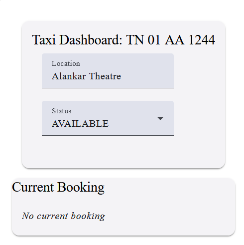

# User Guide

This is a role-based application that supports three types of users. Each role provides a specific set of features tailored to its purpose:

    User: Regular users who want to book a taxi.

    Taxi: Taxi drivers who can view and respond to booking requests.

    Admin: Administrators who can monitor system activities and booking reports.

## Accessing the Application

Once the application is launched, the login page will be displayed as shown in the screenshot below.

After the login page loads, users will see a dropdown menu containing the three available roles, as shown in the screenshot below.

Select one of the following roles from the dropdown to proceed:

Once a role is selected, the application will display a list of corresponding User IDs or Taxi IDs, depending on the chosen role.
As shown in the screenshot below, after selecting the User role, the application displays a list of available User IDs

Choose any User ID from the dropdown menu and click Login to access the User Dashboard for booking a taxi.

## User Dashboard

The User Dashboard displays option to initiate a new taxi booking by selecting the pickup and drop-off locations as shown in the screenshot below.

After selecting the desired pickup and drop-off locations, click the Request Booking button to submit your booking request.

Once a booking is requested, the User Dashboard will display the current booking details, as shown in the screenshot below.

The booking information includes:

    Status of the request (e.g., PENDING, CONFIRMED)

    Pickup location

    Drop-off location

In the example shown, the booking is currently in a PENDING state, awaiting confirmation from an available taxi.

Once an available taxi accepts the request, the booking status will change from PENDING to CONFIRMED.

The dashboard will then update to show:

    Confirmed status

    Pickup location

    Drop-off location

    Assigned Taxi with Taxi no plate

This indicates that your booking has been successfully confirmed and a taxi is on the way.

## Taxi Dashboard

The Taxi Dashboard provides an overview of the taxi’s current status, location, and active booking details.

To access the Taxi Dashboard, start from the login page and follow these steps:

    Select the Taxi role from the role dropdown.

    Choose an appropriate Taxi ID from the list.

    Click Login to proceed.

As shown in the screenshots below, this will log the selected taxi user into the application and load the Taxi Dashboard.

After logging in with a Taxi ID, the Taxi Dashboard will be displayed, as shown in the screenshot below.

The dashboard provides key information for the taxi driver:

    Taxi ID: Displays the registered taxi number (e.g., TN 01 AA 1244).

    Location: Shows the current location of the taxi.

    Status: Indicates whether the taxi is currently ONLINE or AVAILABLE or BOOKED or RIDING.

    Current Booking: Displays the current booking details, if any. If there is no active booking, it will show No current booking.

To take a new ride, the taxi user must follow these steps:

    Ensure that the Taxi Status is set to AVAILABLE. Only available taxis can receive incoming booking requests.

    Once a booking request is received, the request details will appear on the dashboard.

    Review the pickup and drop-off locations.

    Click Accept to confirm the ride and proceed with the booking.

Once a booking request is accepted and confirmed by the Taxi Management System, the Taxi Dashboard will display the current booking information. as shown in the screenshot below,

    The Request ID for reference (e.g., 87be6ba5-bd2c-4e1f-abc7-d670cfd3b0bc)

    A message indicating the passenger's pickup location
    (e.g., "Passenger is waiting at Alankar Theatre")

This confirms that the ride has been assigned and the passenger is ready for pickup.

## Admin Dashboard

The Admin Dashboard provides a centralized view of the Taxi management system, allowing administrators to monitor taxi statuses, view booking reports, and analyze usage trends across the platform.

To access the Admin Dashboard, start from the login page and follow these steps:

    Select the Admin role from the role dropdown.

    Choose an appropriate User ID from the list.

    Click Login to proceed.

As shown in the screenshots below, this will log the selected admin user into the application and load the Admin Dashboard.

After logging in with a Admin User ID, the Admin Dashboard will be displayed with 3 types of reports, as shown in the screenshot below.

    1.Taxi Status

    2.Booking Reports

    3.Booking Report Trends

### Taxi Status

View the real-time availability and status of all registered taxis. This section is selected by default when the Admin Dashboard is loaded.

### Booking Reports

The Booking Reports section displays a chart showing the number of bookings made each day.
This visual representation helps administrators track daily booking activity and identify usage patterns over time.

### Booking Request Trends

The Booking Request Trends section presents a chart comparing the number of booking requests with the number of confirmed bookings over time.

